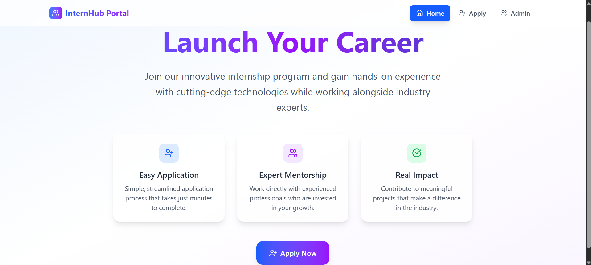
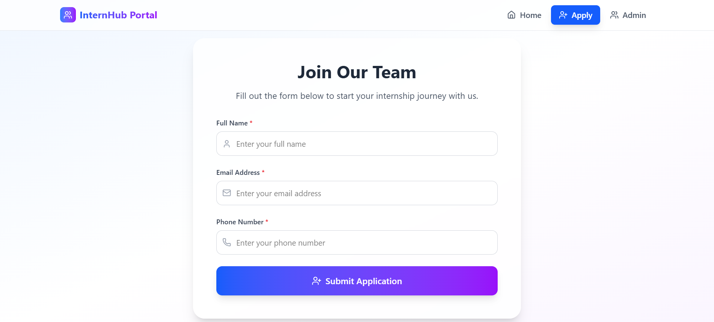
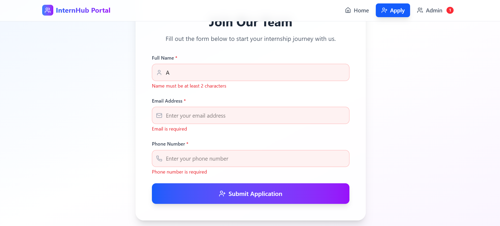
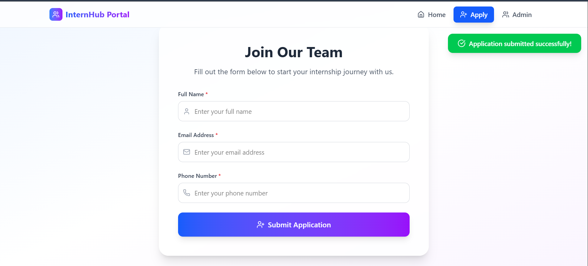
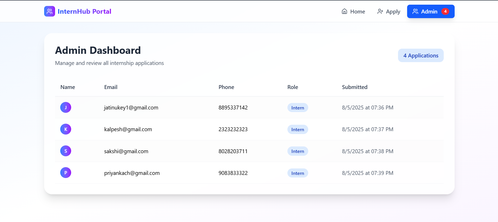
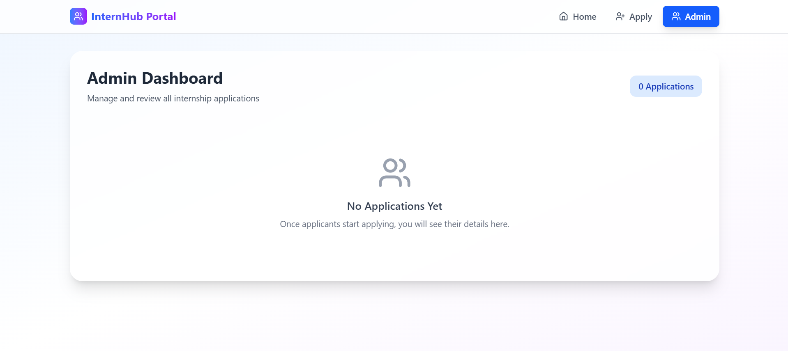
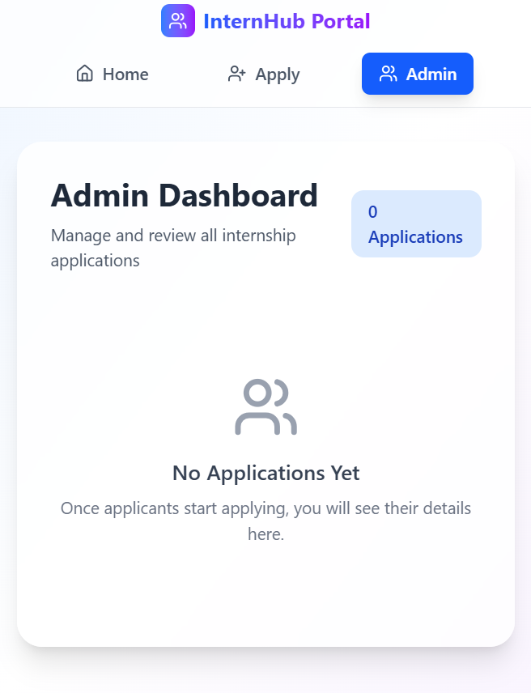

# 🎓 InternHub Portal - Frontend

A simple and responsive full-stack **Internship/Volunteer Portal** built with **React** and **Tailwind CSS**. This is the **frontend repository**, designed to collect intern applications and display applicant data to the admin.

> 🔗 **Backend Repo:** [InternHub Backend](https://github.com/jatin-ukey21/InternHub-portal-backend)  
> ⚠️ **Note:** Please ensure the backend is running locally before starting the frontend.

---

## 🌐 Tech Stack

- **ReactJS (Vite)** – Frontend framework
- **Tailwind CSS** – Utility-first styling
- **Lucide React Icons** – For intuitive iconography
- **Fetch API** – To make API requests to backend
- **Responsive Design** – Works seamlessly on both desktop and mobile

---

## 🧭 Features Overview

### 1. 🏠 Home Page

- Introduces the platform and its core values
- Encourages users to apply for internships

📸 **Screenshot:**


---

### 2. 📝 Apply Page (Registration Form)

- Collects applicant data: Name, Email, Phone, Role
- Validates inputs and displays real-time error messages
- Displays success message after form submission

📸 Screenshots:
- Normal Form: 
- Form Error: 
- Error Highlight: 
- Success Submission: 

---

### 3. 🔐 Admin Dashboard

- Displays all applicant data in a table format
- If no applicants yet, shows placeholder message

📸 Screenshots:
- Applicants Listed: 
- No Applicants: 
- No Applicants (Mobile View): 

---

## 🚀 Getting Started

### 📌 Prerequisites

- Node.js (v16+ recommended)
- Backend server running at `http://localhost:8080`

### 📦 Installation

```bash
# Clone the repository
git clone https://github.com/jatin-ukey21/InternHub-portal-frontend
cd InternHub-portal-frontend

# Install dependencies
npm install

# Run the development server
npm run dev
```

The application will be available at:  
`http://localhost:5173`

---

## 📂 Project Structure

```
src/
├── components/
│   ├── Navigation.jsx          # Navbar with routing buttons
│   ├── Home.jsx                # Homepage content
│   ├── RegistrationForm.jsx    # Intern application form
│   └── Admin.jsx               # Dashboard displaying applicants
│
├── App.jsx                     # Root component with conditional view rendering
├── main.jsx                    # React DOM entry
└── screenshots/                # UI preview screenshots
```

---

## ✨ Author

Crafted by **Jatin Ukey**
